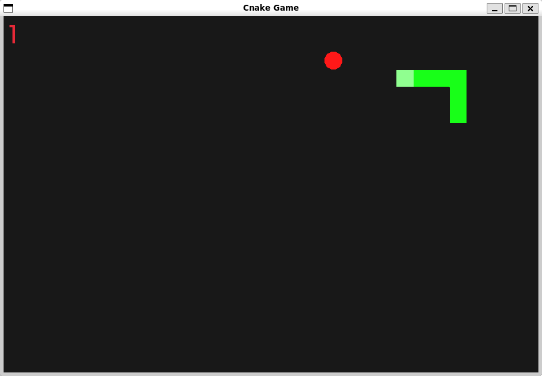
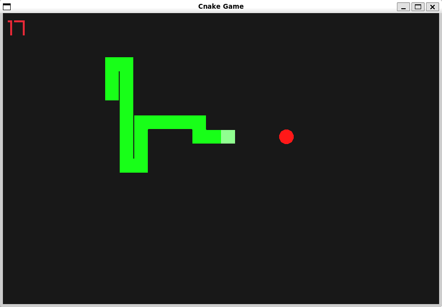

This is an implementation of the classic snake game in C, using Raylib.




*Disclaimer*: This was developed fully in a Linux environment. Do not expect it to work on other platforms.

# Building
Make sure you have [Raylib](https://github.com/raysan5/raylib) installed.

Go to the project root directory and run:
```sh
$ make
```

You should now have the executable `cnake_game`.
```sh
$ ./cnake_game
```

Have fun!

# Controls
- `w` `a` `s` `d`/`arrow keys` to move the snake
- `Space` to restart if the game is over
- `Escape` to pause/unpause the game

