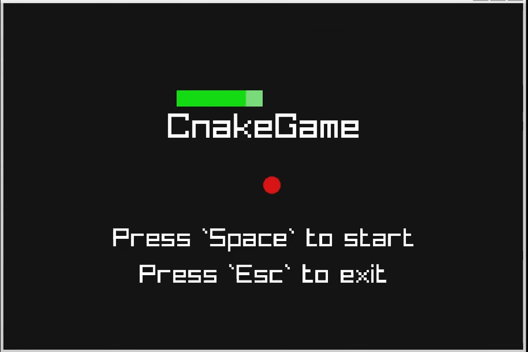

This is an implementation of the classic snake game in C using Raylib.

<br>
<sub>*This a GIF; it is not actually playable.*</sub>

<br>


*Disclaimer*: This was developed fully in a Linux environment. Do not expect it to work on other platforms.

# Dependencies
It is recommended to build the project with the given Makefile.

This project depends on [Raylib](https://github.com/raysan5/raylib), so you need to clone the repository recursively:
```bash
git clone --recurse-submodules https://github.com/GustavoFeio/CnakeGame.git
```
Check [this](https://github.com/raysan5/raylib?tab=readme-ov-file#build-and-installation) out to install Raylib dependencies.

# Building
Go to the project root directory and run:
```bash
make
```

You should now have the executable `cnake_game`:
```bash
./cnake_game
```
Have fun!

# Cleaning
To clean **all** files generated run:
```bash
make clean
```

If you do not want to clean submodule files, simply remove the executable:
```bash
rm ./cnake_game
```

# Controls
- `w` `a` `s` `d`/`arrow keys` to move the snake
- `Space` to start and pause/unpause the game
- `Escape` to exit the game when in the menu, paused, or gameover

